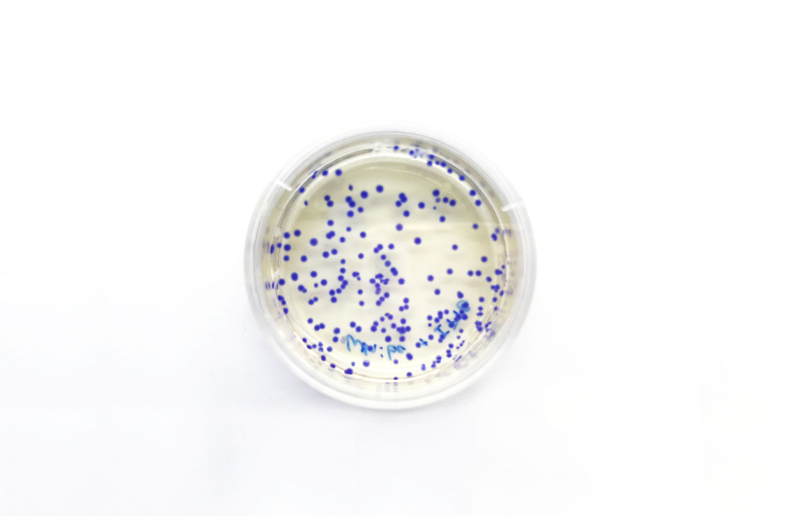
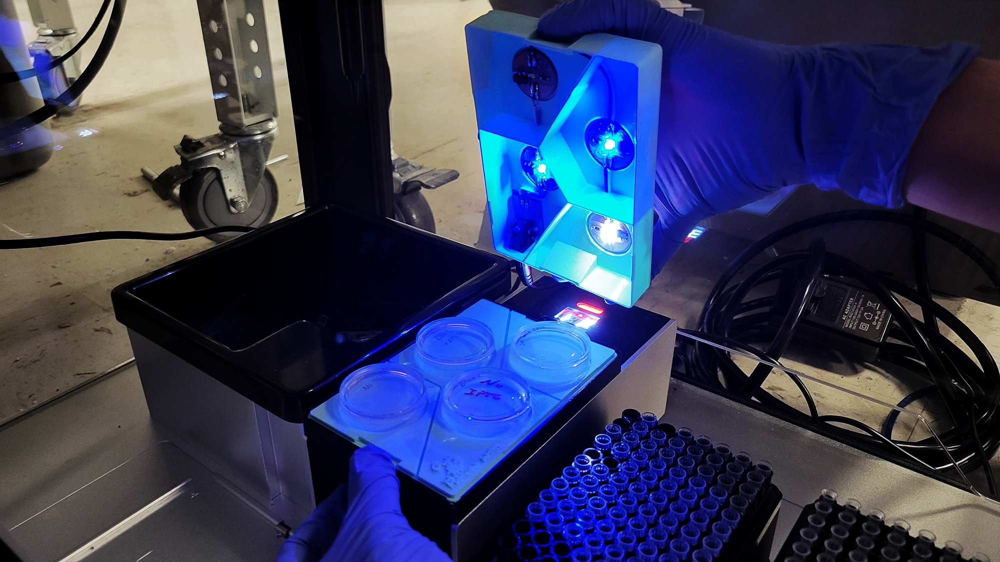

## Microbi Light - Light Module for Opentrons OT-2

 

 

Laura Maria Gonzalez - lmzalez@mit.edu

### Table of Contents

+ About
+ Mechanical Design
+ Electronic Design

### About

Light Module addition to the OT-2 temperature module for testing light genetic circuits.
Consists of four compartments that hold 35mm petri dishes to run multiple test at a time. Can
accomodate different color LEDs to test different optogenetic circuits.

 

### Mechanical Design
Includes STL files for the *[Bottom Plate](mechanical_design/Bottom_Plate.stl)* that holds the 35mm petri dishes and *[Top Lid](mechanical_design/Top_Lid.stl)* that holds the LEDs and separates the compartments.

### Electronic Design
Includes files to mill an LED circuit with on/off switch and a power board to connect to a 12V AC to DC converter.
